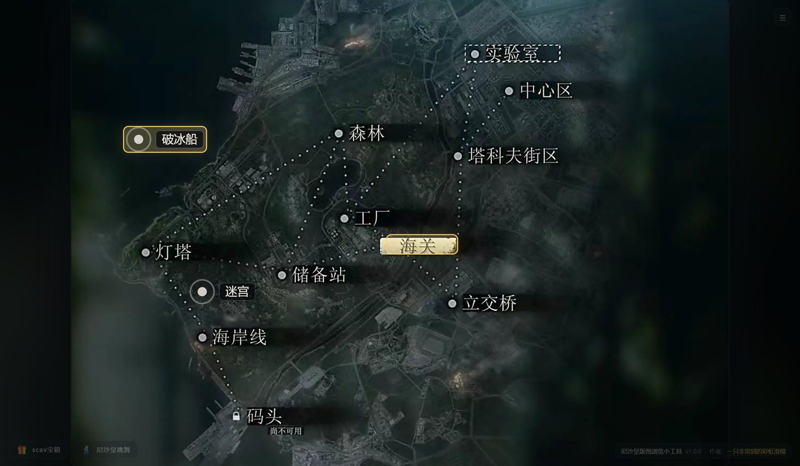
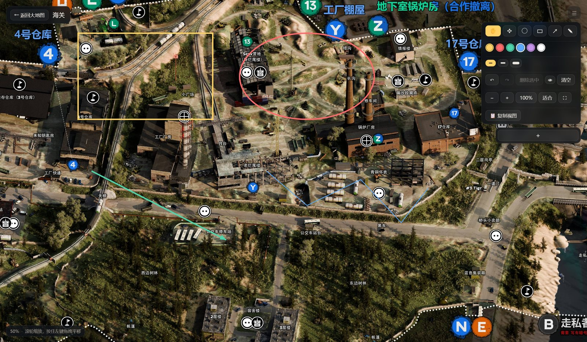
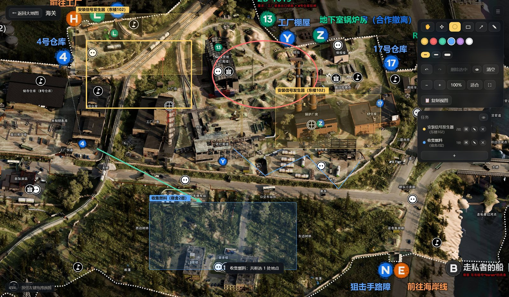

# 尼沙皇版图浏览小工具（AI编程制作）

诺文斯克大地图 + 13 张地区地图的离线浏览器：点开地图、缩放平移、随手画圈画框记任务，标注全部存在自己电脑上，Windows 免安装。



## 下载

到 [Releases](../../releases/latest) 页面下载最新的 `尼沙皇版图浏览小工具-1.0.0-portable.exe`（约 123 MB），双击就能用。

- **免安装**：不写注册表、不需要装运行库，删掉 exe 就等于卸载。
- 单文件版每次启动会先把内容解压到临时目录（约 5～7 秒，期间显示一张启动图），退出后自动清理。
- 想启动更快：用 7-Zip 把 exe 解开，直接跑里面的 `尼沙皇版图浏览小工具.exe`（约 1 秒可用）。
- 系统要求：Windows 10 / 11（64 位）。

## 功能

- **大地图**：诺文斯克全景。13 个地区都是盖住原图文字的方形热区，鼠标移上去高亮、点一下进详情；热区位置可以拖动校准，自动保存。
- **地区地图**：滚轮以光标为中心缩放，按住左键拖拽平移，双击或 `Ctrl+0` 适合窗口，`100%` 看原始像素。
- **标注**：圆、方框、箭头、自由画笔，6 种颜色 3 档线宽；按地图分别保存，换屏幕分辨率也不会偏移。
- **标注编辑**：切到选择工具，点中任意一条就能拖动、改颜色线宽、删除，也能整层隐藏（数据还在）。
- **任务框**：给任务起个名选个颜色，在地图上拖出地点，做完点一下打勾。同一个任务可以横跨多张地图，大地图上会用任务颜色标出哪些地区挂着它。
- **专心看图**：右上角 `☰`（或 `H`）收起整块右侧 UI；「📋 复制视图」把当前画面自动隐去界面元素后复制进剪贴板。
- **彩蛋**：左下角 `🎁 scav宝箱` 抽一把 scav 带回来的物资（价格取自 eftarkov.com 快照，纯娱乐），还有 `🕺 尼沙皇跳舞`。





## 快捷键

| 按键 | 作用 |
| --- | --- |
| `V` / `S` | 移动 / 选择并拖动单条标注 |
| `C` / `R` / `A` / `P` | 圆 / 方框 / 箭头 / 自由画笔 |
| `Ctrl+Z` / `Ctrl+Y` | 撤销 / 重做 |
| `Delete` | 删除选中的标注 |
| 按住 `空格` | 临时拖动平移 |
| `+` / `-` | 放大 / 缩小 |
| `Ctrl+0` | 适合窗口 |
| `F11` | 全屏 |
| `H` | 收起 / 展开右侧 UI |
| `Enter` | 结束任务框选 |
| `ESC` | 关弹窗 / 退出校准 / 结束框选 / 取消选中 / 返回大地图 |

## 数据都在自己电脑上

程序不联网，也没有账号系统，所有内容都存成 `%APPDATA%\尼沙皇版图浏览小工具\` 下的三个文件（应用以前叫「尼沙皇吊图地图浏览」，改名后第一次启动会自动把旧目录的数据搬过来）：

| 文件 | 内容 |
| --- | --- |
| `annotations.json` | 每张地图的标注 + 跨地图任务表 |
| `hotspots.json` | 大地图热区的校准结果 |
| `settings.json` | 界面偏好（面板收起状态、最近浏览、启动位置） |

想备份或换台电脑，把这三个文件拷过去就行。

## 从源码跑

```powershell
npm install      # 首次需要联网下载 Electron
npm start        # 开发模式启动
npm run smoke    # 端到端自检（100 项，用临时数据目录，不动本机数据）
npm run dist     # 打包免安装单文件，产物在 dist/
```

如果下载 Electron / electron-builder 时被网络挡住，可以先设置镜像：

```powershell
$env:ELECTRON_MIRROR='https://npmmirror.com/mirrors/electron/'
$env:ELECTRON_BUILDER_BINARIES_MIRROR='https://npmmirror.com/mirrors/electron-builder-binaries/'
```

打包产物可以再验一遍（会真的启动 exe，通过调试端口跑一遍页面自检）：

```powershell
node tools/verify-packaged.js "dist/尼沙皇版图浏览小工具-1.0.0-portable.exe"
```

### 重新生成素材

```powershell
npm run previews                              # 重新生成预览图、显示用压缩副本与图标（不改原始图片）
python tools/make-previews.py --only splash   # 只重做解压阶段那张启动图
npm run shots                                 # 生成界面截图到 tools/screenshots/
python tools/make-docs-shots.py               # 把截图压成 README 用的 docs/screenshots/
python tools/make-scav-loot.py                # 从 eftarkov.com 重新抓 scav 宝箱的物资与价格
```

## 目录结构

| 路径 | 说明 |
| --- | --- |
| `src/main/` | 窗口、`njt://` 图片协议、本地存储读写 |
| `src/preload/` | 主进程与页面之间的安全桥 |
| `src/renderer/` | 界面、缩放平移、标注绘制、热区校准 |
| `config/regions.json` | 13 个地区的 id / 名称 / 图片 / 热区坐标，以及大地图取景与美化强度 |
| `config/scav-loot.json` | scav 宝箱的物资表与开箱花费 |
| `assets/maps/` | 软件实际加载的显示副本（等分辨率的压缩图） |
| `assets/previews/` | 地区预览图与大地图 2 倍放大版 |
| `assets/portable-splash.bmp` | 单文件版解压阶段的启动图 |
| `assets/icon-source.jpg` | 图标原图（换图标就换这张，再跑 `npm run previews`） |
| `tools/` | 素材生成、自检与打包辅助脚本 |
| `docs/screenshots/` | README 用的截图 |

> 原始地图目录 `尼沙皇吊图/`（约 91 MB 的游戏截图）没有放进仓库，仓库里带的是已经生成好的 `assets/`，所以 clone 下来直接就能跑；只有需要从零重做素材时，才要把原图放进 `尼沙皇吊图/` 再跑 `npm run previews`。

## 已知限制

- 只做了 Windows，打包用的是 Electron 的 `portable` 单文件目标，其它平台没试过。
- 单文件版启动要先自解压（约 5～7 秒，期间是那张静态启动图），想秒开就用解压出来的目录版。
- 地图是静态图片，不是游戏里的实时地图。
- scav 宝箱的物资与价格来自公开快照，出场概率是按价格调过的娱乐数值，不代表游戏里的真实掉落率。

## 作者

- 作者：**一只非常屑的彩虹滑稽** · [B 站主页](https://space.bilibili.com/500638825?spm_id_from=333.1007.0.0)
- 主界面右下角写着版本与作者，点作者名就会打开 B 站主页；版本号取自 `package.json`。

## 免责声明

- 「Escape from Tarkov」及其素材、商标归 Battlestate Games 所有。本项目是非商业的个人作品，地图素材来自游戏画面与社区资料，仅供交流学习，请勿用于商业用途。
- scav 宝箱的物资价格取自 [eftarkov.com](https://www.eftarkov.com/) 的公开页面快照，仅供娱乐。

## 许可

代码以 [MIT 许可](LICENSE) 开源：随便用、随便改、随便发，保留版权声明就行。

地图图片与「Escape from Tarkov」相关的素材、商标**不在**这份许可范围内，版权归 Battlestate Games 所有（见上面的免责声明），请不要把仓库或 Release 里的地图素材单独拿去商用。
